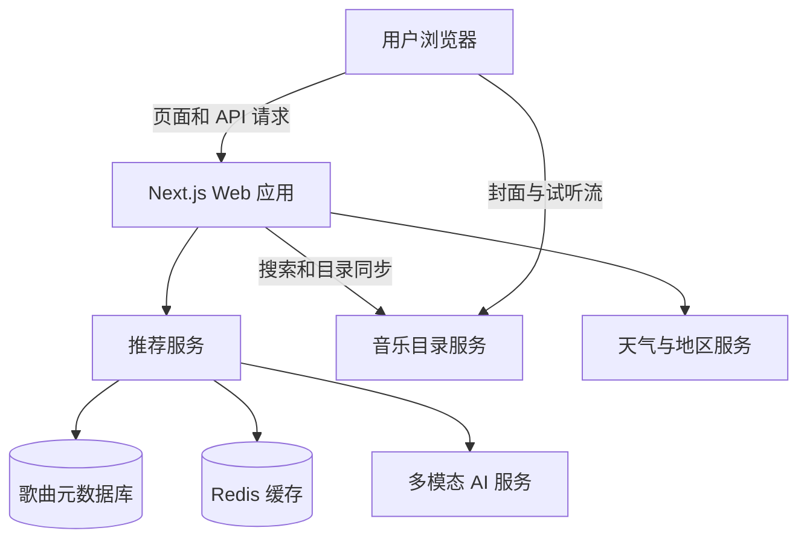
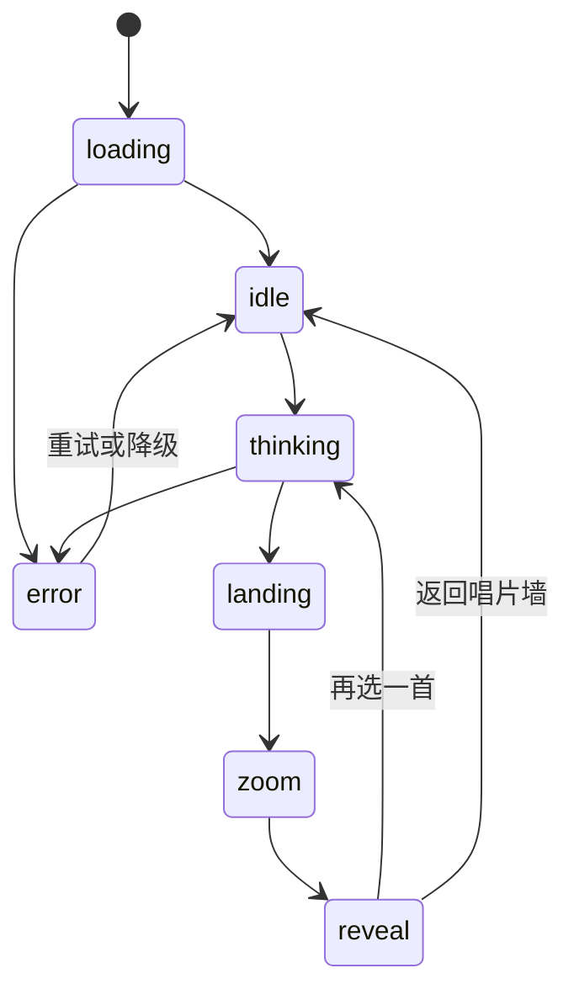
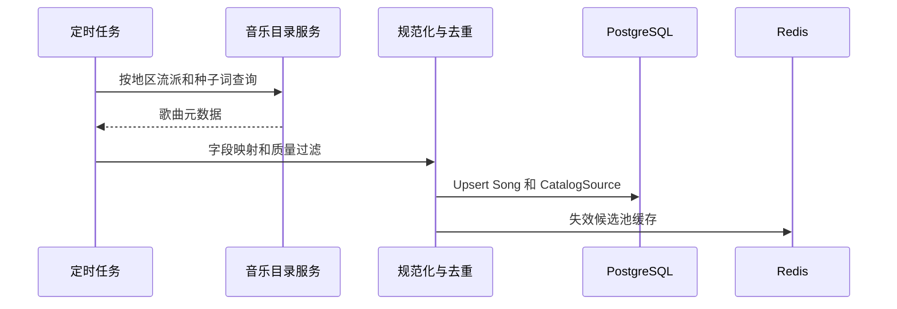

# Music Box 技术架构文档

## 1. 文档目的

本文档描述 Music Box 的目标技术架构、模块边界、数据流、接口契约和关键工程决策。架构优先保证唱片墙性能、第三方音乐资源合规使用、AI 推荐可降级，以及 MVP 可以逐步演进。

## 2. 架构原则

- 浏览器负责渲染和交互，服务端负责目录聚合、推荐和密钥保护。
- 保存歌曲元数据，不保存完整歌曲音频。
- AI 只负责理解与排序增强，系统必须有确定性的规则回退。
- WebGL 场景与 React 业务界面分离，避免高频渲染引发 React 重绘。
- 所有外部数据先规范化为内部 Song 模型。
- 推荐结果必须经过 Schema 校验，并限制在服务端提供的候选集合内。

## 3. 推荐技术栈

| 层级 | 技术 | 用途 |
| --- | --- | --- |
| Web 应用 | Next.js 15 App Router、TypeScript | 页面、Route Handler、服务端逻辑 |
| 界面 | React、Tailwind CSS | 控制台、弹层、推荐结果 |
| 3D 渲染 | Three.js | 唱片墙、相机、纹理和命中检测 |
| 动画 | Framer Motion | DOM 弹层、结果揭示和过渡动画 |
| 状态 | Zustand 或轻量状态机 | 播放状态、推荐流程、场景协调 |
| 数据校验 | Zod | API 输入、外部数据和 AI 输出校验 |
| 数据库 | PostgreSQL | 歌曲、标签、同步记录和推荐日志 |
| 缓存与限流 | Redis | 候选池缓存、天气缓存、速率限制 |
| 文件处理 | 浏览器 Canvas API | 图片缩放与 JPEG 压缩 |
| 监控 | Sentry 加结构化日志 | 前端错误、API 异常和性能追踪 |

早期原型可以使用本地 JSON 或 SQLite 代替 PostgreSQL 和 Redis，但接口边界保持不变。

## 4. 系统上下文



## 5. 前端架构

### 5.1 模块划分

```text
src/
├── app/
│   ├── page.tsx
│   └── api/
│       └── jukebox/
│           ├── wall/route.ts
│           ├── pool/route.ts
│           ├── weather/route.ts
│           └── pick/route.ts
├── components/
│   ├── jukebox/
│   │   ├── JukeboxScene.tsx
│   │   ├── JukeboxHud.tsx
│   │   ├── RecommendationPanel.tsx
│   │   ├── PhotoCaptureDialog.tsx
│   │   └── AudioController.tsx
│   └── ui/
├── engine/
│   └── jukebox/
│       ├── renderer.ts
│       ├── layout.ts
│       ├── card-texture.ts
│       ├── interaction.ts
│       ├── camera-animation.ts
│       └── texture-cache.ts
├── stores/
│   └── jukebox-store.ts
├── server/
│   ├── catalog/
│   ├── recommendation/
│   ├── providers/
│   └── repositories/
└── shared/
    ├── schemas/
    └── types/
```

### 5.2 React 与 Three.js 边界

React 负责低频业务状态和可访问 DOM：控制按钮、照片弹层、加载提示、结果面板和错误信息。Three.js 负责高频画面：卡片布局、拖拽、惯性、镜头和帧循环。

两者通过小型命令接口通信：

```ts
interface JukeboxSceneHandle {
  focusSong(songId: string, alternatives: string[]): Promise<CardBounds>
  resetView(): Promise<void>
  setPlayingSong(songId: string | null): void
  setHighlightedSongs(scores: Record<string, number>): void
}
```

不得在每一帧把卡片坐标写入 React state。高频坐标、速度、纹理和 mesh 引用保存在引擎对象或 `useRef` 中。

### 5.3 WebGL 场景

- 使用一个 `WebGLRenderer`、一个 Scene 和一个 Camera。
- 所有卡片复用同一个 `PlaneGeometry`。
- 每张卡片使用独立材质或可演进为纹理图集和实例化渲染。
- 卡片沿圆柱或球面片段排列，位置由行、列和视口比例计算。
- Raycaster 将点击坐标映射到歌曲卡片。
- 拖拽改变场景经纬偏移，松手后由阻尼衰减速度。
- 选歌时暂停自由漂移，执行卡片落位、镜头缩放和结果揭示。

### 5.4 卡片纹理生成

每张歌曲卡片先在离屏 Canvas 2D 中绘制，再转为 `CanvasTexture`：

```text
封面图 + 背景模糊色调 + 歌名 + 歌手
       + 试听进度 + 播放控件 + 状态高亮
                         ↓
                   CanvasTexture
                         ↓
                   Three.js Mesh
```

资源加载采用两级策略：

1. 先请求极小封面或占位色，快速确定主色调。
2. 卡片接近视口时加载 200 px 封面。
3. 聚焦结果卡片时升级到 400 px 封面。
4. LRU 缓存限制高分辨率纹理数量，并在淘汰时调用 `dispose()`。

### 5.5 音频控制

- 全站只创建一个 `HTMLAudioElement`。
- 播放前根据歌曲 ID 更新 `src`。
- 监听 `timeupdate`、`play`、`pause`、`ended` 和 `error`。
- WebGL 卡片只接收归一化进度和播放状态，不持有音频对象。
- 首次用户手势时完成移动端音频解锁。

### 5.6 推荐状态机



状态切换只能由统一的推荐控制器完成，防止动画、音频和面板状态不同步。每次请求带递增 request ID，过期响应不得覆盖新请求。

## 6. 服务端架构

### 6.1 API 职责

| API | 方法 | 职责 |
| --- | --- | --- |
| `/api/jukebox/wall` | GET | 返回初始墙面歌曲、粗略地区和数据来源 |
| `/api/jukebox/pool` | GET | 返回指定地区的推荐候选池 |
| `/api/jukebox/weather` | GET | 返回经过缓存和标准化的天气信息 |
| `/api/jukebox/pick` | POST | 图片理解、候选排序和推荐结果生成 |
| `/api/health` | GET | 部署与依赖健康检查 |

生产环境不应提供让浏览器直接提交第三方 API 密钥的通用代理接口。

### 6.2 音乐目录适配器

```ts
interface MusicCatalogProvider {
  search(input: SearchSongsInput): Promise<Song[]>
  lookup(ids: string[], countryCode: string): Promise<Song[]>
  getCharts?(countryCode: string): Promise<Song[]>
}
```

首个适配器可接入 iTunes Search API。适配器负责：

- 将第三方字段映射为内部 Song。
- 统一国家代码、图片尺寸和外部链接。
- 丢弃没有合法外链或关键字段缺失的数据。
- 标记试听 URL 是否可用。
- 对重复版本、合辑和显式内容执行产品规则。

试听 URL 不写入长期静态文件，也不通过本服务代理下载。客户端从来源 CDN 流式播放，并按服务条款显示来源和外部链接。

### 6.3 歌曲目录同步



MVP 可以使用人工维护的种子词和歌曲 ID。同步任务按地区、流派、年代和场景分批查询，避免依赖单一热门榜单。

### 6.4 推荐服务

推荐分为三层：

1. 规则过滤：地区可用性、试听可用性、显式内容策略、近期排除。
2. 粗排：基于标签、时间、天气、图片描述和多样性从候选池选出 30 至 80 首。
3. 精排：由 AI 或加权规则输出主推荐与两个备选。

AI 请求只包含精简后的候选字段，不发送整个数据库记录：

```ts
{
  context: {
    localTime: "15:30 afternoon",
    weather: "overcast 22C",
    city: "Shanghai",
    imageCaption: "a quiet cafe by a rainy window"
  },
  candidates: [
    { id: "123", title: "...", artist: "...", tags: ["calm", "rainy"] }
  ]
}
```

模型必须返回受约束的 JSON：

```ts
const RecommendationSchema = z.object({
  selectedId: z.string(),
  alternatives: z.array(z.object({
    id: z.string(),
    score: z.number().min(0).max(1)
  })).length(2),
  score: z.number().min(0).max(1),
  reason: z.string().max(180)
})
```

服务端校验所有 ID 均属于候选集合。校验失败、模型超时或预算耗尽时，立即使用规则排序结果。

### 6.5 图片处理

- 浏览器负责缩放和 JPEG 压缩，减少上传时间和推理成本。
- 服务端验证 MIME、文件大小、编码和像素上限。
- 图片通过内存或短生命周期对象存储传递给模型。
- 默认不写入长期数据库。
- 日志不得记录图片 Base64、原图 URL 或可识别内容。

### 6.6 天气与地区

- 粗略地区从可信的部署平台请求头或服务端 IP 地理信息得到。
- 不依赖浏览器精确定位，除非未来增加明确的用户授权流程。
- 天气按城市或网格缓存 10 至 30 分钟。
- 服务不可用时返回 `null`，不阻断唱片墙与随机推荐。

## 7. 数据模型

### 7.1 核心表

```text
Song
├── id UUID
├── source enum
├── sourceTrackId string
├── title string
├── artist string
├── album string nullable
├── artworkUrl string
├── previewUrl string nullable
├── externalUrl string
├── countryCode string nullable
├── genre string nullable
├── releaseYear integer nullable
├── energy decimal nullable
├── valence decimal nullable
├── active boolean
├── createdAt timestamp
└── updatedAt timestamp

SongTag
├── songId UUID
└── tag string

CatalogSync
├── id UUID
├── provider string
├── query string
├── status string
├── itemCount integer
├── error string nullable
└── completedAt timestamp nullable

RecommendationEvent
├── id UUID
├── anonymousSessionId string
├── selectedSongId UUID
├── alternativeSongIds JSON
├── mode enum
├── context JSON
├── durationMs integer
├── success boolean
└── createdAt timestamp
```

推荐日志中的地区应降精度；照片与完整 IP 不进入日志。

## 8. API 契约

### 8.1 获取唱片墙

```http
GET /api/jukebox/wall?country=CN
```

```json
{
  "songs": [],
  "location": {
    "city": "Shanghai",
    "country": "China",
    "countryCode": "CN"
  },
  "source": "catalog-cache"
}
```

### 8.2 获取推荐

```http
POST /api/jukebox/pick
Content-Type: application/json
```

```json
{
  "image": "data:image/jpeg;base64,...",
  "random": false,
  "countryCode": "CN",
  "exclude": ["song-1", "song-2"],
  "context": {
    "city": "Shanghai",
    "country": "China",
    "weather": "overcast, 22C",
    "localTime": "15:30 afternoon",
    "day": "Sunday"
  }
}
```

响应：

```json
{
  "pick": {
    "song": {},
    "score": 0.78,
    "reason": "适合阴天下午的舒缓节奏"
  },
  "alternatives": [
    { "song": {}, "score": 0.71 },
    { "song": {}, "score": 0.68 }
  ],
  "considered": 250,
  "contextSummary": "周日下午 上海 阴天 22C",
  "mode": "ai"
}
```

## 9. 缓存策略

| 数据 | 建议 TTL | 说明 |
| --- | --- | --- |
| 初始唱片墙 | 15 分钟 | 按国家和版本缓存 |
| 候选池 | 1 至 6 小时 | 按国家、流派和内容策略缓存 |
| 天气 | 10 至 30 分钟 | 按城市或网格缓存 |
| 音乐目录搜索 | 1 至 24 小时 | 遵守第三方服务条款 |
| AI 推荐 | 默认不跨用户缓存 | 可对完全匿名的随机请求短暂缓存 |

第三方试听音频不进入服务端或 Service Worker 缓存。

## 10. 性能预算

- 初始 JavaScript 压缩后目标小于 300 KB；Three.js 相关代码动态加载。
- 首屏只加载当前视口和邻近区域所需的中等分辨率封面。
- 高分辨率纹理上限建议为 200 至 260，移动端进一步降低。
- 每帧不创建临时 Vector、Material 或 Geometry 对象。
- 页面隐藏时暂停渲染循环和音频进度广播。
- 动画中避免读取和写入 DOM 布局交错发生。
- 推荐接口 P95 目标小于 4 秒，规则回退目标小于 500 ms。

## 11. 安全设计

- 所有第三方密钥保存在服务端环境变量。
- API 使用 Zod 校验请求和响应。
- 图片请求限制大小、格式和频率。
- 对推荐接口按 IP 哈希和匿名会话限流。
- 外部 URL 必须来自允许的域名列表，防止开放重定向和 SSRF。
- AI 返回的文本按普通文本渲染，不使用未清洗 HTML。
- 日志对 IP、地区和图片内容进行最小化处理。

## 12. 可观测性

前端事件：

- `wall_loaded`
- `song_preview_started`
- `song_preview_failed`
- `recommendation_requested`
- `recommendation_revealed`
- `external_link_opened`
- `webgl_fallback_used`

服务端指标：

- API 成功率、P50、P95 和 P99 延迟。
- 音乐目录供应商错误率。
- AI 调用延迟、Token 和单次推荐成本。
- 规则回退率和 Schema 校验失败率。
- 纹理加载失败率与前端 FPS 分布。

## 13. 部署架构

MVP 可采用单体部署：

```text
Vercel 或 Node 容器
├── Next.js 页面
├── Route Handlers
├── 推荐服务
└── 定时同步入口

托管 PostgreSQL
托管 Redis 可选
第三方音乐目录 天气 AI
```

当目录同步、推荐请求或成本规模扩大后，再拆分为独立 Worker。MVP 阶段不建议过早采用微服务。

## 14. 测试策略

### 单元测试

- 歌曲字段规范化与去重。
- 推荐规则和排除逻辑。
- AI 输出 Schema 校验与回退。
- 卡片空间布局函数。
- 图片压缩参数和错误处理。

### 集成测试

- 音乐目录适配器的录制响应测试。
- `/wall`、`/pool` 和 `/pick` 契约测试。
- 数据库 Upsert 和缓存失效。
- 天气或 AI 失败时的降级路径。

### 端到端测试

- 进入页面并看到唱片墙。
- 拖拽后卡片位置发生变化。
- 点击歌曲并开始试听。
- 发起随机推荐并进入结果状态。
- 上传测试图片并完成推荐。
- 返回墙面后音频和动画状态正确复位。

### 视觉与性能测试

- 桌面、平板和移动端关键视口截图回归。
- Chrome Performance 长任务检查。
- WebGL 上下文丢失与低性能设备降级测试。
- `prefers-reduced-motion` 模式检查。

## 15. 关键风险与应对

| 风险 | 影响 | 应对 |
| --- | --- | --- |
| 第三方试听 URL 失效 | 用户无法播放 | 定期巡检、展示外链、允许无试听歌曲被过滤 |
| 大量纹理导致显存压力 | 卡顿或崩溃 | LRU、分级图片、像素比限制和资源释放 |
| AI 输出歌曲不存在 | 推荐错误 | 候选 ID 白名单和 Zod 校验 |
| AI 超时或费用过高 | 推荐不可用 | 规则回退、超时、候选压缩和限流 |
| 图片包含隐私信息 | 合规风险 | 明示用途、短期处理、默认不保存和日志脱敏 |
| 音乐资源条款变化 | 法律和产品风险 | 供应商适配层、定期条款复核和可切换数据源 |

## 16. 架构决策记录

### ADR 001 使用 CanvasTexture 绘制歌曲卡片

**决定：** 使用离屏 Canvas 2D 绘制卡片，再映射到 Three.js Mesh。

**原因：** 可以在单个 WebGL 场景中呈现大量视觉复杂卡片，避免大量 DOM 节点参与布局和合成。

**代价：** 文本不是天然可访问内容，需要在 DOM 结果区提供等价信息，并维护纹理失效与重绘逻辑。

### ADR 002 使用单一音频元素

**决定：** 全站共用一个 `HTMLAudioElement`。

**原因：** 简化移动端自动播放限制、资源释放、进度同步和同时播放控制。

### ADR 003 AI 不是强依赖

**决定：** 推荐链路必须包含规则回退。

**原因：** 控制延迟、成本和第三方故障影响，同时保证随机选歌始终可用。

### ADR 004 不托管试听音频

**决定：** 试听片段由合法来源 CDN 直接流式播放。

**原因：** 降低版权、存储、带宽和内容更新风险。

## 17. 建议实施顺序

1. 建立 Song Schema、固定 JSON 和单音频控制器。
2. 完成 Three.js 卡片纹理、空间布局、拖拽和 Raycaster。
3. 建立推荐状态机与镜头过渡。
4. 接入 `/wall` 和音乐目录适配器。
5. 加入天气、粗略地区和规则推荐。
6. 加入图片压缩、图片理解和 AI 精排。
7. 增加缓存、限流、监控和目录同步任务。
8. 完成性能、无障碍、隐私和第三方条款验收。
