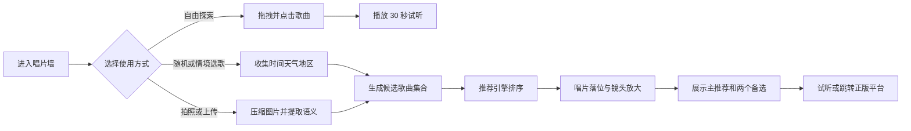

# Music Box 产品需求文档

## 1. 文档目的

本文档定义 Music Box 第一阶段产品目标、用户体验、功能边界和验收标准。产品参考 Jev Jukebox 的沉浸式唱片墙与情境选歌体验，但采用独立品牌、视觉表达和实现，不复制原站名称、文案或受保护素材。

第一阶段的目标是上线一个可用的 Web MVP：用户能够在可拖拽的唱片墙中浏览歌曲、试听官方短音频，并根据时间、天气、地点或照片获得一首推荐歌曲。

## 2. 产品概述

Music Box 是一个“此刻只推荐一首歌”的沉浸式音乐发现产品。页面以 3D 唱片墙作为主要界面，用户既可以自由探索，也可以让推荐引擎结合当前情境完成选歌。

产品不提供完整歌曲播放，不存储或分发未经授权的音乐文件。歌曲封面、试听片段和外部收听链接由合法音乐目录服务提供。

## 3. 产品目标

### 3.1 MVP 目标

- 在桌面端和移动端呈现流畅、可拖拽的 3D 唱片墙。
- 支持点击歌曲卡片播放或暂停官方试听片段。
- 支持随机选歌，以及基于时间、天气、粗略地区的情境选歌。
- 支持用户拍照或上传图片，并将图片语义作为推荐上下文。
- 通过完整的选歌动画，将用户从探索状态带入单曲结果状态。
- 推荐结果展示主推荐、匹配度、推荐依据和两个备选结果。
- 允许用户跳转到正版音乐平台继续收听。

### 3.2 非目标

- 不提供完整歌曲托管、下载或离线播放。
- 不在 MVP 中实现用户账号、社交关系、评论或歌单协作。
- 不承诺替代 Spotify、Apple Music 等流媒体播放器。
- 不在 MVP 中训练自有推荐模型。
- 不追求与参考网站逐像素一致。

## 4. 目标用户与核心场景

### 4.1 目标用户

- 想快速找到符合当下氛围歌曲的普通听众。
- 喜欢探索音乐、视觉网站和互动体验的用户。
- 希望通过照片、天气或时间获得个性化推荐的用户。

### 4.2 核心使用场景

1. 用户打开网站，拖拽唱片墙浏览歌曲并试听。
2. 用户不知道听什么，点击“为此刻选一首”。
3. 用户上传街景、聚会、旅途或房间照片，请系统匹配歌曲。
4. 用户查看推荐理由和备选歌曲，并跳转到正版平台继续收听。

## 5. 用户体验流程



## 6. 功能需求

### 6.1 唱片墙

- 页面主体为全屏 WebGL 画布。
- 歌曲卡片以弧形或环绕式空间结构排列。
- 支持鼠标拖拽、触摸拖拽和滚轮导航。
- 松手后保留有限惯性，并平滑减速。
- 卡片进入视觉中心时可获得轻微高亮。
- 点击卡片后播放试听；再次点击暂停。
- 播放状态、试听进度和选中状态必须反馈在卡片上。
- 用户启用“减少动态效果”时，应关闭强缩放和复杂位移动画。

### 6.2 歌曲试听

- 全站只维护一个音频播放器实例。
- 同一时间只能播放一首歌曲。
- 切歌时自动停止上一首。
- 展示已播放时间、剩余时间、播放和暂停状态。
- 试听地址无效时显示可恢复错误，不阻塞其他交互。
- 不下载、缓存或重新托管第三方试听音频。

### 6.3 情境选歌

- 默认使用当地时间、星期、天气和粗略地区作为上下文。
- 地区优先从服务端请求信息推断，不强制申请浏览器精确定位权限。
- 用户可以选择随机模式，随机模式仍应避免短期重复。
- 客户端保留最近 40 首推荐歌曲 ID，用于排除重复结果。
- 推荐超时或 AI 服务不可用时，回退到本地规则排序。

### 6.4 照片输入

- 支持移动端相机拍摄和本地图片上传。
- 支持 JPEG、PNG 和 WebP；默认最大文件为 10 MB。
- 客户端将图片最长边压缩至 768 px，输出 JPEG，质量约 0.82。
- 上传前明确说明照片将用于本次推荐。
- 默认不永久保存原始照片。
- 摄像头权限被拒绝时，提供文件上传入口。

### 6.5 推荐过程

- 推荐状态机包括 `idle`、`thinking`、`landing`、`zoom`、`reveal` 和 `error`。
- 思考阶段显示当前正在使用的上下文，但不伪造精确的模型推理过程。
- 主推荐必须属于当前候选歌曲集合。
- 结果至少包含主推荐、两个备选、匹配度和简短推荐依据。
- 点击“再选一首”时排除近期推荐结果。
- 用户可随时返回唱片墙。

### 6.6 推荐结果

- 展示封面、歌名、歌手和试听控件。
- 匹配度作为排序置信提示，不描述为科学准确率。
- 展示本次考虑的候选歌曲数量。
- 展示参与推荐的上下文摘要，例如“周日下午、阴天、上海”。
- 提供正版音乐平台跳转按钮。

### 6.7 歌曲目录管理

- 系统保存歌曲元数据，不保存完整歌曲文件。
- 最低字段包括歌曲 ID、歌名、歌手、专辑、封面 URL、试听 URL、外部链接、国家和流派。
- 推荐所需的情绪、能量、年代和场景标签可以由规则或 AI 离线补充。
- 定时检查失效试听链接、重复曲目和缺失封面。
- MVP 候选池建议为 300 至 1000 首；推荐请求只发送压缩后的候选摘要。

### 6.8 错误与空状态

- 初始歌曲加载失败时提供重试按钮。
- 天气服务失败时继续使用时间、地区和随机特征推荐。
- 图片分析失败时允许改用无图推荐。
- 试听链接失效时仍允许跳转外部平台。
- WebGL 不可用时显示简化的二维卡片列表。

## 7. 页面与组件

| 页面或组件 | 主要职责 |
| --- | --- |
| 唱片墙页面 | 3D 浏览、歌曲命中检测、试听入口 |
| 顶部品牌区 | 产品名称、简短说明和必要外链 |
| 底部控制台 | 照片入口、随机推荐、上下文摘要 |
| 推荐过渡层 | 思考、落位、镜头移动和背景虚化 |
| 推荐结果面板 | 主推荐、匹配度、备选、外部链接 |
| 图片采集弹层 | 摄像头预览、拍摄、取消和错误处理 |

## 8. 数据需求

```ts
interface Song {
  id: string
  title: string
  artist: string
  album?: string
  artworkUrl: string
  previewUrl?: string
  externalUrl: string
  countryCode?: string
  genre?: string
  releaseYear?: number
  tags: string[]
  energy?: number
  valence?: number
  source: "itunes" | "apple_music" | "manual"
  updatedAt: string
}
```

推荐响应建议为：

```ts
interface RecommendationResult {
  pick: { song: Song; score: number; reason: string }
  alternatives: Array<{ song: Song; score: number }>
  considered: number
  contextSummary: string
  imageCaption?: string
  mode: "ai" | "rules" | "random"
}
```

## 9. 非功能需求

### 9.1 性能

- 桌面端目标为 60 FPS，主流移动端目标不低于 30 FPS。
- 首屏可交互时间目标小于 3 秒，慢速网络下应先显示骨架或低分辨率纹理。
- 同时驻留的高分辨率 GPU 纹理应设置上限，建议不超过 200 至 260 张。
- 画布像素比在高分屏设备上应限制上限，移动端建议不超过 1.5。

### 9.2 可用性与无障碍

- 核心操作支持键盘触发。
- 按钮提供可访问名称，颜色对比度满足 WCAG AA。
- Canvas 提供文本替代说明；推荐结果使用真实 DOM 呈现。
- 尊重 `prefers-reduced-motion`。

### 9.3 隐私与安全

- 图片仅用于生成当次推荐，除非用户明确同意，否则不永久保存。
- 第三方 API 密钥只保存在服务端环境变量中。
- 图片大小、内容类型、请求频率和 JSON 结构均需校验。
- 对 AI 输出执行 Schema 校验，禁止直接信任模型返回内容。

### 9.4 版权与合规

- 不保存或分发完整歌曲音频。
- 试听片段必须从许可来源流式加载。
- 遵守音乐目录服务对封面、试听、来源标识和商店跳转的要求。
- 上线前完成第三方 API 服务条款复核。

## 10. 指标

- 唱片墙成功加载率。
- 推荐接口成功率和 P95 响应时间。
- 试听启动成功率。
- 推荐后试听率。
- 外部平台跳转率。
- 7 日内重复推荐率。
- WebGL 降级页面触发率。

## 11. MVP 验收标准

- 用户无需登录即可进入唱片墙。
- 桌面端和移动端均可拖拽浏览。
- 至少 100 张歌曲卡可以稳定显示，且不会创建 100 个独立音频实例。
- 点击任一带试听地址的歌曲可开始播放，并能暂停或切换。
- 随机推荐可在 3 秒内给出结果，AI 不可用时仍能返回结果。
- 情境推荐能够使用时间、天气和粗略地区。
- 上传图片后可完成一次推荐，图片不会出现在其他用户会话中。
- 结果页包含一首主推荐、两个备选和正版平台链接。
- 最近推荐不会在短时间内重复出现。
- WebGL、图片、天气或试听任一能力失败时都有明确降级路径。

## 12. 迭代计划

### 阶段一 交互原型

- 固定歌曲 JSON。
- Three.js 唱片墙。
- 拖拽、命中检测和单音频播放器。

### 阶段二 可用 MVP

- 接入音乐目录 API。
- 天气与地区上下文。
- 随机及规则推荐。
- 完整选歌动画和结果页。

### 阶段三 AI 推荐

- 图片理解。
- 结构化 AI 排序。
- 推荐解释和失败回退。

### 阶段四 产品化

- 目录定时同步。
- 监控、限流和成本控制。
- 多音乐平台链接和多语言支持。
